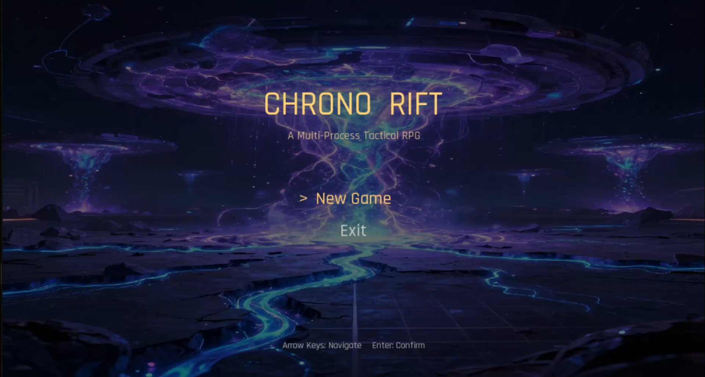
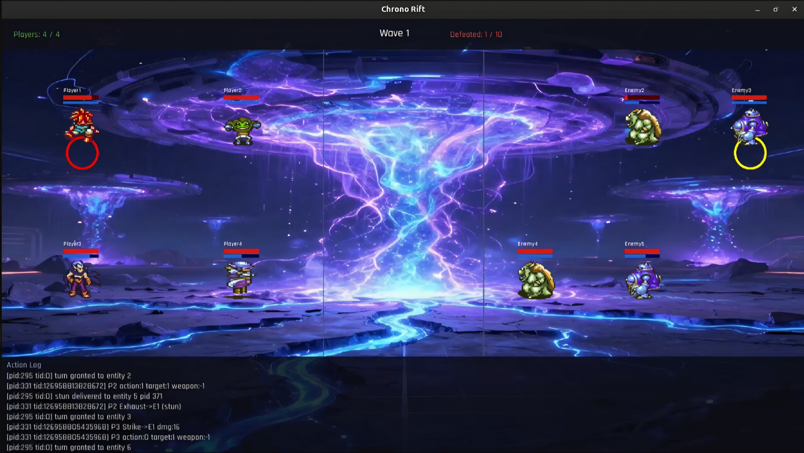
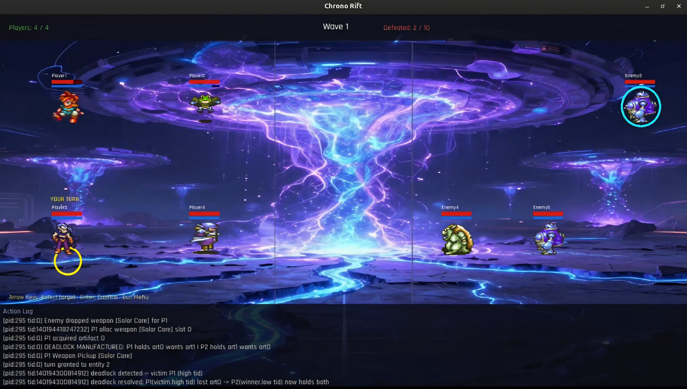

# Chrono Rift ⚔️

*Every OS concept you studied (processes, threads, shared memory, semaphores, signals, deadlock) now working together inside a real game.*

A multi-process turn-based tactical RPG built in C++ with SFML, developed as a semester project for CS 2006 - Operating Systems at FAST-NUCES. Lead your party of heroes against waves of enemies where every mechanic under the hood is a live, running OS concept.

---

## 📺 Demo Video

▶️ **Watch the gameplay video:** [YouTube](https://www.youtube.com/watch?v=ioIQqOnaFug)

---

## 📸 Screenshots


*Main Menu*


*Turn-based combat with stamina scheduling*


*DeadlockMonitor detecting and resolving a circular artifact wait*

---

## 🏗️ Architecture Overview

Chrono Rift runs as **three separate processes**, each with a distinct responsibility:

- **Game Arbiter** — The central authority. Owns the global game state, enforces turn order, spawns HIP and ASP, drives the full game loop, and renders the SFML window on the main thread.
- **Human Interfacing Process (HIP)** — Handles all keyboard input from the player. Writes chosen actions into shared memory for the Arbiter to resolve.
- **Automated Strategic Process (ASP)** — Manages all enemy decision-making. Each enemy runs in its own dedicated thread inside the ASP; all threads run concurrently but only the one granted a turn by the Arbiter acts.

All three processes communicate exclusively through a **single POSIX shared memory segment**, no pipes anywhere.

---

## 🛠 Features

### ⚙️ Operating Systems Concepts in Action

- **Processes & IPC:** Three-process design (Arbiter, HIP, ASP) with all state shared through a `SharedState` struct in a POSIX shared memory region
- **Semaphores:** Five unnamed POSIX semaphores embedded directly in shared memory — `shmLock` (general state guard), `turnSem` (Arbiter→entity turn grant), `actionSem` (entity→Arbiter action done), `artifactLock` (resource table guard), `logLock` (action log guard)
- **Multithreading:** Arbiter runs concurrent threads for the Stamina Timer, Deadlock Monitor, Renderer, and Game Loop; ASP runs one thread per enemy
- **Signals:** `SIGUSR1` delivers the Stun mechanic (target process pauses 3 seconds); `SIGSTOP`/`SIGCONT` implement the Ultimate Ability (ASP suspended for 10 seconds via `SIGALRM` handler); `SIGTERM` triggers clean quit
- **Deadlock Detection & Resolution:** Solar Core, Lunar Blade, and Eclipse Relic are exclusive artifact resources tracked in a `ResourceTable`. A background DeadlockMonitor thread runs a DFS cycle-detection algorithm on the wait-for graph every second. When a circular wait is detected, the monitor picks the victim (highest thread ID), strips its held artifact, and breaks the deadlock automatically
- **Memory Management:** Each player carries a 20-slot primary inventory modelled as a contiguous linear array. The `InventoryAllocator` finds the smallest free contiguous block for each pickup. If no block fits, it evicts the minimum number of weapons to long-term storage to make room — Solar Core and Lunar Blade each occupy 10 slots, so holding both fills the inventory completely

### 🎮 Gameplay

- **Turn-based combat** with stamina-based scheduling — entity speed determines how fast stamina fills to trigger a turn, directly analogous to arrival-time scheduling
- **4-player co-op** support (1–4 players in the same party)
- **Wave-based progression** — defeat 10 enemies to win
- **4 playable characters** (Crono, Frog, Magus, Slash) with unique sprites
- **3 enemy types** (Cybot, Goblin, Macabre) with independent AI threads
- **Actions:** Strike, Exhaust (stun), Use Weapon, Swap In, Heal, Skip, Ultimate
- **Artifact system:** Solar Core, Lunar Blade, and the dynamically spawned Eclipse Relic grant powerful bonuses — collect any two to unleash your Ultimate Ability
- **Ultimate Ability:** Freezes all enemies (SIGSTOP to ASP) for 10 full seconds
- **Weapon drop system:** Enemies drop weapons on death; unique artifacts have only one instance in play at a time
- **Persistent action log** with PID, thread ID, and timestamp for every game event
- **Complete game states:** Main Menu → Party Select → Battle → Wave Transition → Win / Lose

---

## 📁 Project Structure

```
ChronoRift/
├── arbiter/
│   ├── arbiter.cpp              # Entry point — spawns HIP & ASP, runs game loop
│   ├── gameArbiter.cpp/.h       # Core engine: scheduler, deadlock monitor, renderer, allocator
│   ├── sharedState.h            # SharedState struct — the entire game state
│   ├── sharedMemoryUtilities.cpp/.h
│   └── stats.cpp/.h
│
├── hip/
│   ├── hip.cpp                  # HIP entry point
│   ├── hipManager.cpp/.h        # Keyboard input + player action submission
│   ├── sharedMemoryUtilities.cpp/.h
│   └── stats.cpp/.h
│
├── asp/
│   ├── asp.cpp                  # ASP entry point
│   ├── aspManager.cpp/.h        # Enemy AI threads
│   ├── sharedMemoryUtilities.cpp/.h
│   └── stats.cpp/.h
│
├── Makefile                     # Build all three processes
├── Dockerfile                   # Ubuntu 22.04 + SFML environment
└── report.pdf                   # Full OS concepts analysis and turnaround time report
```

---

## ⚙️ Dependencies

- **C++17** or later
- **SFML** — graphics, window, audio, network, system
- **POSIX** — pthreads, shared memory (`sys/shm.h`), semaphores (`semaphore.h`), signals
- **Linux** (Ubuntu 22.04 recommended — use the provided Docker environment)

---

## 🚀 Build & Run

### Using Docker (Recommended)

```bash
docker build -t chronorift .
docker run -it --rm \
  -e DISPLAY=$DISPLAY \
  -v /tmp/.X11-unix:/tmp/.X11-unix \
  -v $(pwd):/app \
  chronorift
```

Inside the container:

```bash
make
./arbiters
```

### Manual Build (Linux with SFML installed)

```bash
make
./arbiters
```

The Arbiter will automatically spawn the HIP and ASP processes. All three binaries (`arbiters`, `hips`, `asps`) must be in the same directory.

### Clean

```bash
make clean
```

---

## 🎮 Controls

| Action | Key |
|---|---|
| Navigate menus / select target | `↑` / `↓` / `←` / `→` or `W` / `A` / `S` / `D` |
| Confirm selection | `Enter` |
| Back / Cancel | `Escape` |
| Player Select for Eclipse Relic | `1` / `2` / `3` / `4` |

---

## 👨‍💻 Developers

**Muhammad Mughees Tariq Khawaja** — [LinkedIn](https://linkedin.com/in/mugheestariq)

---

## 📜 License & Acknowledgments

This project was developed for educational purposes as part of the **CS 2006 - Operating Systems** course at FAST-NUCES, Spring 2026. Character and enemy sprite assets are used for academic demonstration only.
